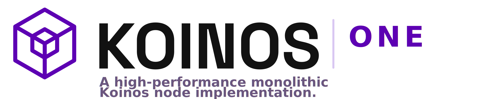

<p align="center">
  
</p>

# Koinos One

Koinos One is the Koinos Foundation desktop app for running, restoring, backing up, and producing with a native **Koinos** node. It is powered by the Teleno native node engine and manages the single `teleno_node` runtime.

## Stack

- **Desktop app:** Koinos One, built with Electron + React + TypeScript
- **Node runtime:** monolithic `teleno_node`
- **Runtime model:** one local process with in-process Koinos components
- **Platforms:** macOS first, Windows planned

## Repository Layout

The active node code and UX live in this repository. Legacy Koinos material remains only where it is needed for protocol compatibility evidence, migrations, or upstream references.

```text
assets/                 Koinos One branding and UI assets
config/                 Ready-to-use node config templates
docs/current/           Current implementation docs
docs/backlog/           Missing work and documented future ideas
docs/legacy/            Legacy compatibility evidence
docs/operations/        Operator docs, including command-line startup
docs/roadmap/           Historical roadmap records and validation reports
electron/               Electron main process, IPC, native runtime control
node/teleno-node/       Monolithic C++ Koinos node source
scripts/                Build, benchmark, smoke, soak, and packaging helpers
src/                    React renderer and shared frontend logic
tests/                  UI test assets
tools/                  Local migration and private-testnet helpers
vendor/                 Upstream Koinos references retained for compatibility
```

## Quick Start

```bash
git clone --recurse-submodules git@github.com:pgarciagon/koinos-one.git
cd koinos-one
npm install
npm run dev
```

If the repository was cloned without submodules, run:

```bash
git submodule update --init --recursive
```

## Build The Monolithic Node

The C++ source tree lives under `node/teleno-node`. CMake builds the monolith executable as `teleno_node`, and packaging stages the same binary name.

```bash
./scripts/build-cpp-libp2p-koinos.sh
```

The previous `koinos_node` binary name is no longer the active runtime name. Use `teleno_node` for local launches, packaging, logs, and UI runtime status.

## Running The Node

Koinos One manages one local `teleno_node` process. The Node tab reports the resolved runtime version, BASEDIR, binary path, and log path together so operators can confirm exactly what is running.

For direct command-line startup on public testnet or mainnet, see:

```text
docs/operations/START_TELENO_NODE.md
```

Key runtime notes:

- `features.block_producer` controls whether the monolith starts production logic.
- If `block_producer` starts and `BASEDIR/block_producer/private.key` is missing, `teleno_node` creates a new producer hot key and writes the matching `BASEDIR/block_producer/public.key`.
- PoB production still requires `block_producer.producer` in the active runtime config.
- Mainnet block production requires an explicit `block_producer.producer` entry in the active `BASEDIR/config.yml`; the UX will not silently infer a mainnet producer address from a wallet.
- Testnet/custom producer starts may fill a missing producer address from the saved Producer profile or active signing wallet.

Observer runs should explicitly disable block production:

```bash
./node/teleno-node/build/teleno_node \
  --basedir /path/to/basedir \
  --log-level info \
  --disable block_producer grpc
```

Legacy microservice build/start scripts are not part of the active Koinos One command surface. Legacy-facing scripts are retained only when they prove protocol compatibility, migration safety, or parity with existing Koinos clients and peers.

## Building For Distribution

```bash
npm run package:mac:dir       # unsigned local .app directory
npm run package:mac           # signed and notarized DMG, when credentials are configured
npm run package:mac:unsigned  # unsigned development DMG
```

## Development

```bash
npm run dev:renderer
npm run build
npm run test
```

Use `npm run dev` to run the complete Electron development app. Open the renderer-only build at `http://localhost:5173` when you only need the frontend.

## Architecture

```text
Electron UI
  |
  +-- Dashboard      (node, peer, producer, and performance views)
  +-- Explorer       (blocks, transactions, inline detail)
  +-- Wallet         (accounts, transfers, burn, producer setup)
  +-- Settings       (runtime config, language, paths)
  |
  +-- electron/main.ts
        |
        +-- teleno_node
              |
              +-- chain, mempool, p2p, block store, jsonrpc, grpc,
                  account history, transaction store, contract metadata,
                  and block producer components
```

## Validation

Common local checks:

```bash
npm run build
cmake --build node/teleno-node/build --target teleno_node --parallel
cmake --build node/teleno-node/build --target koinos_block_producer_test --parallel
ctest --test-dir node/teleno-node/build --output-on-failure -R koinos_block_producer_test
```

The current focused block producer test covers missing private-key auto-generation and reload behavior.

## References

- Koinos: https://koinos.io
- Blockchain backups: https://seed.koinosfoundation.org/backups
- Compatibility evidence: `docs/legacy/compatibility/README.md`
