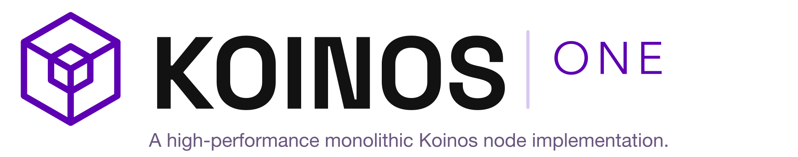
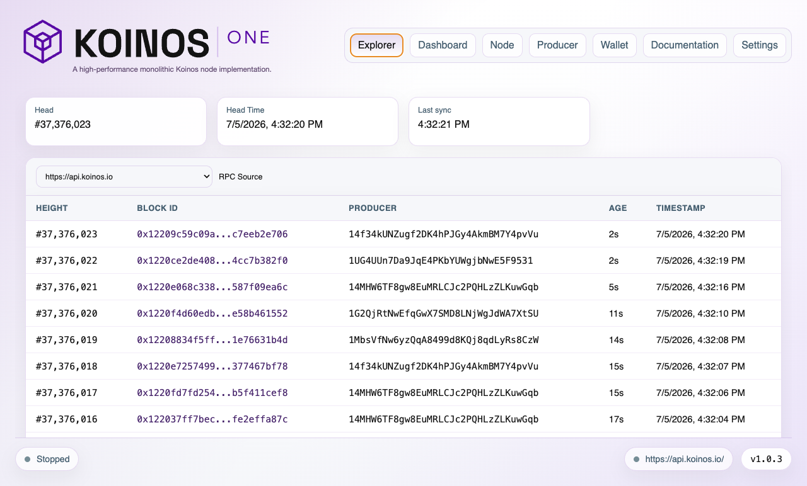
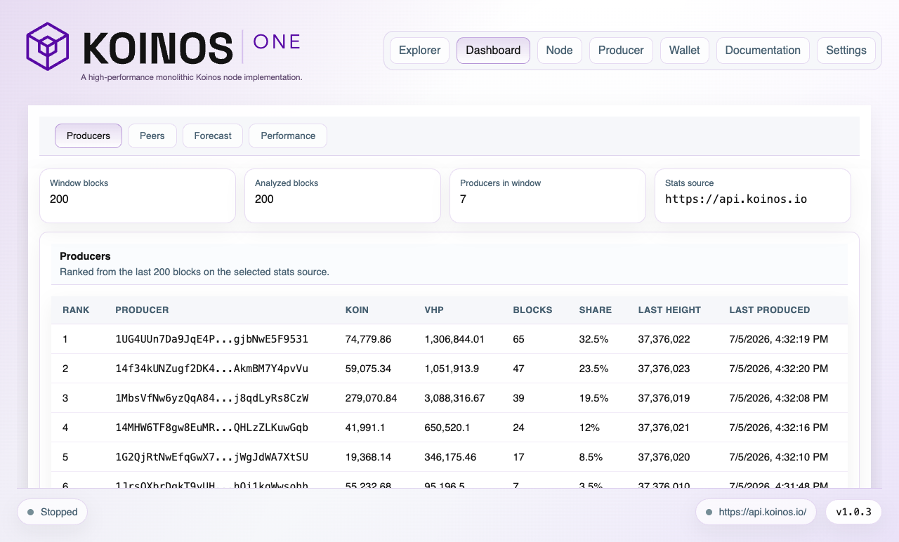
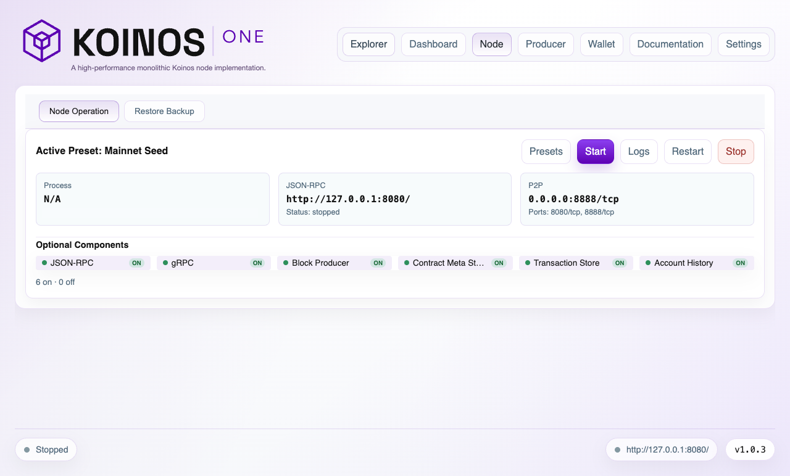
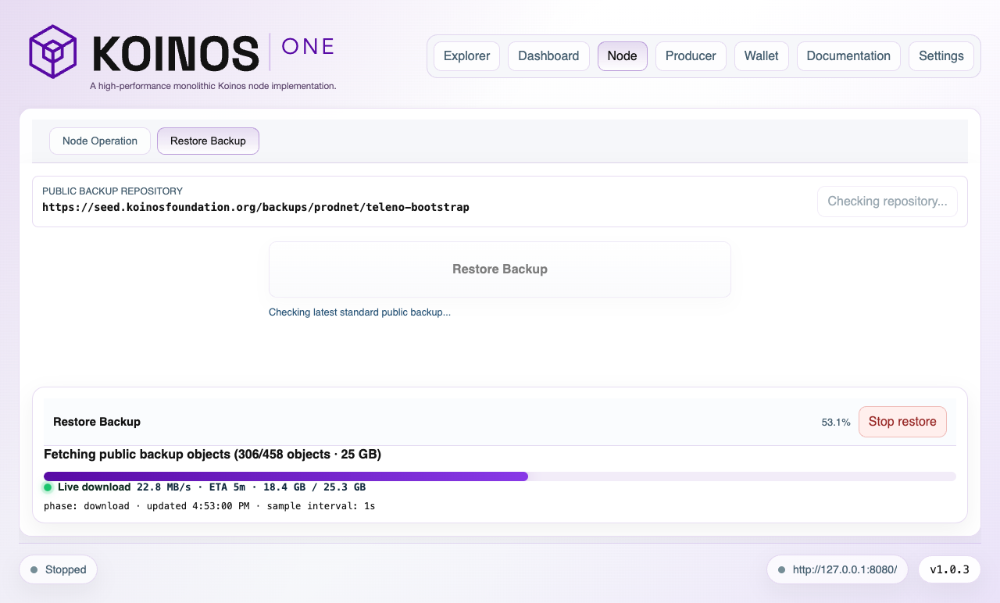
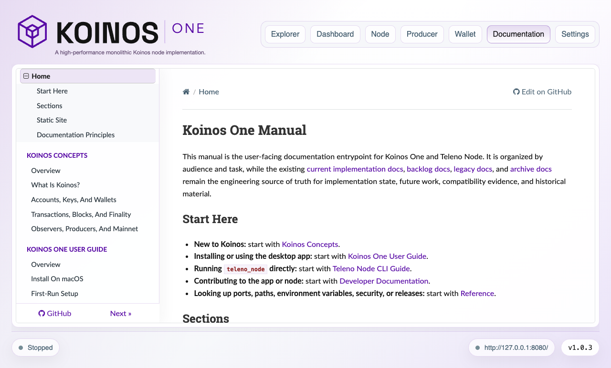

# Medium Article Package: Introducing Koinos One

## Author

Koinos Community Foundation

## Recommended Title

Introducing Koinos One

## Title Options

1. Introducing Koinos One
2. Koinos One: A Monolithic Node For Practical Koinos Operation
3. Putting Koinos Infrastructure Back In Front Of Users

## Subtitle Options

1. A Koinos Community Foundation initiative to make high-performance local node operation more visible, approachable, and useful for the ecosystem.
2. We are introducing Koinos One: a monolithic Koinos node and desktop app for users, operators, producers, and developers who want to run real infrastructure.
3. After a quieter period for public Koinos infrastructure development, we are putting working software back in front of the community.

## Image Assets

Use these images in the Medium draft. If Medium does not preserve local
Markdown image paths, upload the files manually in the same order.

| Placement | File | Suggested caption |
| --- | --- | --- |
| Logo under title | `docs/marketing/assets/koinos-one-logo.png` | Koinos One: a high-performance monolithic Koinos node implementation. |
| First product screenshot | `docs/marketing/assets/koinos-one-electron-explorer-live-blocks.png` | The Explorer shows recent Koinos mainnet blocks from a public RPC source. |
| Dashboard producers section | `docs/marketing/assets/koinos-one-electron-dashboard-producers.png` | The Dashboard Producers tab ranks recent block producers from the selected stats source. |
| Node operations section | `docs/marketing/assets/koinos-one-electron-node.png` | The Node tab keeps local runtime state, presets, ports, and components visible. |
| Backup and restore section | `docs/marketing/assets/koinos-one-electron-restore-progress.png` | Public bootstrap restore shows live progress while preparing an observer node. |
| Documentation section | `docs/marketing/assets/koinos-one-electron-documentation.png` | The built-in manual keeps user, operator, and developer documentation inside the app. |

## Final Medium-Ready Article

# Introducing Koinos One

**By the Koinos Community Foundation**

*Koinos One: a high-performance monolithic Koinos node implementation.*

We are introducing Koinos One as a Koinos Community Foundation initiative and as another step in the Foundation's core mission: helping keep the Koinos network stable, operational, and increasingly decentralized.

Following the dissolution of Koinos Group, the company that initially launched Koinos, one of the Foundation's main responsibilities was to help stabilize the network and preserve continuity for the ecosystem. That responsibility remains intact. Our primary work is still to support network stability, strengthen public infrastructure, and help the community operate Koinos with more confidence.

Koinos One fits directly into that mission.

Koinos One is a high-performance monolithic Koinos node implementation, packaged with a desktop application for running and operating the Koinos blockchain.

We built it because network stability is not achieved only by keeping a few services online. A decentralized network becomes stronger when more people can run nodes, more operators can maintain infrastructure, and more producers can participate safely.

This is more than a software announcement. It is a Foundation initiative for the Koinos ecosystem, and it reflects a simple belief: we strengthen Koinos by making it easier for more people to participate directly in the network.

Koinos belongs to its community. We improve it by building tools that help users become operators, help operators become contributors, and help developers understand the infrastructure they are building on. Each capable node operator adds redundancy. Each safer producer path expands the group of people who can support the network.

For a long time, public development momentum around Koinos infrastructure has felt quiet. Many people who have followed Koinos know the technology is interesting, but visibility matters. A blockchain ecosystem needs more than belief. It needs working software that people can download, run, test, discuss, and improve together.

Koinos One is our step in that direction.

We want to put practical Koinos infrastructure back in front of users, operators, producers, and developers. Public attention does not return to a project through words alone. It returns when working software is visible, usable, and grounded enough for people to build around it.

*The Explorer shows recent Koinos mainnet blocks from a public RPC source.*

## Why This Matters Now

Blockchain ecosystems need more than ideas. They need working infrastructure, and they need that infrastructure to be accessible to the people who care about the network.

As a community, we need software that operators can run, developers can inspect, and users can understand. We need clear entry points. We need visible progress. We need a way for people who have been watching from the sidelines to say, "I can try this now."

That is the role we want Koinos One to play.

Koinos has always been an ambitious blockchain project. Its resource model, feeless user experience, upgradeability, and developer-oriented architecture have made it different from many other chains. But infrastructure is what turns a protocol into something people can participate in.

Node operation is one of the clearest forms of participation. When more people can run nodes, observe the network, understand the state of the chain, and eventually operate more advanced roles safely, our ecosystem becomes more visible, more resilient, and more durable.

Koinos One is a practical milestone in that direction.

Koinos One should be evaluated as software, not as a finished claim. The current release does not mean that every compatibility gap is closed or that every operator workflow is complete.

What is available now is concrete: a monolithic node implementation, a desktop application, built-in documentation, and operational workflows that can be downloaded, run, inspected, and tested.

That gives the community a working baseline for validation, feedback, and further development.

## What Running Your Own Full Node Means

Running a full node locally is one of the most important acts of participation in a decentralized network.

It means a user is not only consuming blockchain data from an API service. They are running software that follows the network, verifies chain data, and gives them their own source of truth about what the blockchain state is.

That distinction matters for trust.

If a wallet, explorer, or application only depends on third-party API nodes, the user is trusting those services to be online, correct, and honest about the state they report. Public API nodes are useful, and they will continue to be useful, but they are still infrastructure operated by someone else.

A local node changes that relationship. It lets the user inspect the network from their own machine. It gives them an independent way to verify what is happening. It reduces dependence on any single hosted endpoint. When the local node is synced and connected, it can also support wallet operations and transaction submission through the user's own infrastructure.

That matters for redundancy too.

If public API services are unavailable, overloaded, misconfigured, censored, or simply wrong, a user with a working local node has another path. They can continue to observe the chain, inspect blocks, and participate through peer-to-peer network connectivity instead of waiting for a centralized service to recover.

This is what decentralization looks like at the practical level. It is not only a protocol property. It is also a question of how many people can run real infrastructure, verify the network independently, and keep useful access paths alive when shared services fail.

That is why we care about local full-node operation. It is not only a technical feature. It is part of the social and operational health of the ecosystem.

This is why Koinos One matters to us: it lowers the barrier to that kind of participation.

## Why Koinos One Exists

Running blockchain infrastructure is often harder than it should be.

Even experienced operators usually have to manage several moving parts: binaries, services, configuration files, logs, ports, data directories, backups, restore procedures, RPC endpoints, peer connectivity, wallet material, and producer safety rules.

That complexity creates a barrier. It makes local node operation feel like specialist work. It also makes public infrastructure development harder to follow because useful work is often hidden behind terminal sessions, private runbooks, and scattered operational notes.

We created Koinos One to make Koinos node operation more visible and approachable while staying close to real node behavior.

Our goal is not to hide the node behind a decorative interface. Our goal is to give users a clearer operational surface:

- start and inspect a local node;
- see which network and runtime settings are active;
- monitor sync and node status;
- understand where local data lives;
- restore from a public bootstrap source when appropriate;
- manage wallet and account workflows carefully;
- keep producer-related actions explicit;
- read the documentation in the same app where the node is operated.

We want the desktop app to reduce friction without hiding the important safety boundaries.

## What Koinos One Is

Koinos One has two connected parts.

The first is `teleno_node`, the native monolithic Koinos node binary. It embeds runtime components that were historically operated as separate services and provides the foundation for a simpler local node architecture.

The second is the Koinos One desktop app. The app packages, operates, monitors, documents, and helps manage that node from a graphical interface.

Together, they create a desktop-first operating environment for Koinos infrastructure.

This distinction matters. Koinos One is not only a GUI. The interface is important because it makes node operation easier to understand, but the core technical direction is the monolithic node implementation and the operational experience around it.

The desktop app gives the node a visible surface. The monolithic node gives the desktop app a simpler runtime to supervise.

## The Monolithic Direction

The monolithic direction matters because operational complexity is one of the practical barriers to decentralization.

A node made of many separately managed services can be powerful, but it can also be hard to package, hard to explain, and hard to run locally. Each service brings its own configuration surface, logs, failure modes, and process management.

A monolithic node implementation reduces that complexity.

The practical advantages are straightforward:

- fewer services to start, stop, and supervise;
- simpler local packaging;
- a more direct operator experience;
- clearer backup and restore boundaries;
- easier build identity and release traceability;
- a stronger foundation for desktop-first node management.

For Koinos, this matters because broad participation depends on practical operation. A blockchain ecosystem cannot rely only on a small number of hosted infrastructure providers if the goal is a healthier, more visible, more resilient network.

We want local node operation to become more realistic for more people.

We built Koinos One around that direction.

## A Full Rewrite, Not A New Network

Koinos One is not a thin wrapper around the existing microservices-based Koinos node implementation. It is a complete rewrite of that software into a monolithic node architecture.

That is a significant engineering step, and it only matters if compatibility remains the standard.

Our goal is not to create a different Koinos. Our goal is to run the same Koinos network with a simpler and more operationally practical node implementation. A `teleno_node` node must follow the same protocol rules, validate the same blockchain, and share the same consensus with the existing Koinos node software.

This compatibility requirement has guided the work from the beginning. Koinos One has been run and tested extensively on both testnet and mainnet, because a node implementation only earns confidence by operating against real network conditions.

At the same time, this is still the first public release of a rewritten node binary. For that reason, the Koinos Community Foundation does not yet recommend running the majority of the network's VHP on nodes operated by the `teleno_node` binary.

We want adoption to be responsible. Observers, developers, infrastructure operators, and producers should test, inspect, compare, and build confidence over time. Producers who experiment with Koinos One should do so gradually, keep operational fallbacks, and avoid concentrating too much consensus weight on any new implementation before it has accumulated more public runtime history.

## What Users Can Do Today

We are making Koinos One available for early users who want to run and inspect practical Koinos infrastructure.

Today, the app can help users:

- run and monitor a local Koinos node;
- inspect node, peer, producer, and performance information;
- use public bootstrap restore to prepare a node faster from a read-only backup source;
- manage local wallet and account workflows;
- prepare observer and producer workflows with explicit safety guidance;
- access built-in documentation for users, operators, and developers;
- inspect build identity so packaged builds remain traceable.

*The Dashboard Producers tab ranks recent block producers from the selected stats source.*

The current desktop focus is macOS. Windows and Linux desktop binaries are planned over time, while the native node remains the center of the implementation.

Koinos One starts from an observer-first operational model. An observer follows and verifies the network without producing blocks. Producer setup, transaction signing, VHP burns, key registration, and mainnet-affecting operations remain explicit actions that should be handled carefully.

That safety model is intentional. We want to make node operation easier, but we do not want powerful actions to become casual or accidental.

*The Node tab keeps local runtime state, presets, ports, and components visible.*

## Public Bootstrap Restore

One of the most important operational workflows in Koinos One is public bootstrap restore.

Starting a new node from scratch can take time. Public bootstrap restore gives users a way to restore from a published read-only backup source before continuing normal sync. Our goal is to make observer setup faster without requiring SSH credentials or private backup access.

In Koinos One, this workflow is treated carefully:

- public means the backup source is read-only;
- backup and restore administration remains local-only;
- restored nodes should start as observers first;
- producer migration is not treated as a casual one-click action;
- verification and safety messaging remain part of the flow.

That balance is important. Speed is useful, but safety is more important when users are dealing with blockchain state, wallets, and potential producer operations.

*Public bootstrap restore shows live progress while preparing an observer node.*

## Wallets, Producers, And Safety

Koinos One includes wallet and account workflows, but we are intentionally conservative around signing and producer-related actions.

Running an observer node should not require a wallet. Observing the network and producing blocks are different responsibilities.

Actions such as sending tokens, burning KOIN into VHP, registering or replacing producer keys, enabling block production, or changing producer-affecting configuration require a different level of care.

Koinos One reflects that distinction. We are designing the app around explicit steps, visible state, and safety checks rather than hidden automatic behavior.

That is especially important for mainnet operation. Our goal is not to make powerful actions feel casual. Our goal is to make the right state visible before the user takes action.

## Documentation As Part Of The Product

Koinos One includes a built-in manual because operating a node is not just a UI problem.

Users need concepts. Operators need workflows. Developers need architecture notes. Producers need safety boundaries. As a Foundation, we also need to make our work legible so the community can inspect it, challenge it, improve it, and build on it.

The manual is organized around:

- Koinos blockchain concepts;
- the Koinos One user guide;
- the `teleno_node` command-line guide;
- developer documentation for the desktop app and native node;
- reference material for ports, config files, security, release channels, and glossary terms.

For us, this is part of the product strategy. Documentation should not live far away from the software. It should be close to the operational surface.

*The built-in manual keeps user, operator, and developer documentation inside the app.*

## Operational Clarity As A Product Goal

We are designing Koinos One around operational clarity.

That means the app should make important state visible:

- which network is selected;
- where local data lives;
- whether the node is running;
- whether sync is moving;
- which RPC endpoint is being used;
- which backup source is selected;
- which preset or node mode is active;
- what a user is about to change.

This is not only a usability preference. It is an infrastructure requirement.

When software controls node processes, local data, wallets, backups, and producer settings, the user must be able to understand what is happening. A blockchain operator interface should be calm, explicit, and inspectable.

We are moving Koinos One toward that model.

## A Visibility Milestone For Koinos

We see Koinos One as a visibility milestone for the Koinos ecosystem.

For a long period, the public story around Koinos infrastructure has been quiet. That kind of pause can make even strong technology feel distant. Communities need visible artifacts that show where practical work is happening.

We want Koinos One to provide one.

It gives users something to try. It gives operators something to inspect. It gives developers a repository, a native node, a desktop app, and documentation to study. It gives our broader community a concrete object around which to restart technical conversation.

That does not mean the work is finished. It means the work is visible.

And visibility matters.

## Who Koinos One Is For

Koinos One is for several groups at once.

It is for Koinos users who want to run a local observer node, see what the network is doing, and do it without depending on API nodes operated by third parties.

With Koinos One, the user is not only looking at someone else's endpoint. They are running a real node in the Koinos ecosystem. They can explore the consensus blockchain directly and, when their local node is synced and connected, route wallet operations through their own infrastructure. Even if public API nodes are unavailable, they can still participate in the network through their own node.

It is for operators who care about backups, restore paths, node status, and operational safety.

It is for producers who need clearer workflows before taking mainnet-affecting actions.

It is for developers who want to understand how a monolithic Koinos node can be built, packaged, tested, and maintained.

It is also for people who have been away from Koinos for a while and want a concrete reason to look again.

Most importantly, it is for the community. We are not building Koinos One as a closed product separate from the ecosystem. We are building it as shared infrastructure: something the community can use, test, discuss, improve, and hold to a higher standard.

## What Comes Next

Koinos One is still early, so our roadmap has two responsibilities at the same time: make node operation easier for normal users, and keep powerful blockchain operations explicit, reviewable, and safe.

The first priority is to keep improving the basic observer experience. A new user should be able to install Koinos One, choose where the node data lives, restore from a public backup when one is available, start as an observer, and understand whether the node is healthy without needing to read terminal output.

That path will continue to improve through clearer first-run guidance, better restore progress, stronger backup evidence, signed public backup metadata, safer disk-space estimates, and lower-disk restore options for servers where keeping a full local copy of the public backup repository is not practical. The goal is simple: make the first safe Koinos node experience understandable.

The next major product direction is remote node installation and operation. Many operators will want to run Koinos nodes on user-owned Linux servers while still controlling them from the desktop app. Koinos One should help those operators add a server, review a safe plan, install the node, restore a public backup, start an observer, verify health, and keep receipts of what happened.

That remote path should remain conservative. It should begin with bring-your-own-server workflows, SSH-based execution, local-only inventory, redacted logs, and clear confirmations. Provider integrations can come later, but the safety model should not depend on storing cloud provider tokens or hiding infrastructure changes behind a button.

Over time, we want a unified fleet view. A Koinos operator should be able to see local and remote observers, standby nodes, and producer candidates in one place. The app should show which network each node is on, whether the node is synced, whether public RPC or admin surfaces are safely bound, which backup source was used, and whether the node is ready for a more advanced role.

Producer operation is another major roadmap area. We want Koinos One to make the producer path understandable: create or import the right wallet, understand Mana and VHP, fund explicitly, burn KOIN into VHP when the user chooses to, register the producer key, validate the node, and only then enable production.

That is very different from hiding mainnet mutation behind a generic "one click" producer button. Funding, VHP burns, VHP transfers, producer-key registration, and producer activation should remain explicit steps with visible network, signer, producer address, hot key, amounts, and expected result. Koinos One can make the workflow easier without making custody or consensus weight movement invisible.

We also want to support safer VHP distribution across independent producer identities. A healthy ecosystem should not encourage operators to concentrate too much exposure in one place or reuse one key across many machines. Koinos One should help operators reason about distribution, readiness, redundancy, and fallback plans before production is enabled.

This is also an incentive question. If we want more people to run Koinos infrastructure, new operators need a path that makes participation meaningful. They should be able to run a healthy node, present themselves clearly to the community, and attract VHP from holders who want to support additional infrastructure without running their own node.

Fogata pool support is another important future step. Fogata-style pools are not just normal producer addresses. They are smart-contract-controlled producer pools with distinct owner, participant, beneficiary, payer, and node-operator roles. Supporting them properly means treating them as their own workflow: launch or import a pool, show the contract and pool parameters, configure metadata and beneficiaries, connect the node operator, monitor pool stake and VHP, and inspect produced blocks.

The strategic goal is to let a capable node operator launch a producer, expose it as a pool, define a transparent operator fee, and communicate that pool to the Koinos community. VHP holders could then distribute part of their VHP toward newly created operators, helping expand the infrastructure base without requiring every holder to become an operator.

That work must be proven carefully. Fogata support should move through testnet validation, contract review, and clear UX before any mainnet rollout. The app should distinguish clearly between an independent producer and a pool-managed producer role.

This matters because the cost profile of infrastructure is changing. Data centers are becoming more expensive, especially as storage and RAM costs rise. Koinos should not depend only on a small number of centralized hosting environments. If Koinos One can make local operation, remote self-owned servers, and community-supported operators easier, it can help move more of the ecosystem toward a broader and more resilient infrastructure base.

Wallet functionality should also grow. Koinos accounts can hold more than KOIN and VHP, and Koinos One should evolve toward better support for compatible tokens defined by the standard. That means discovering balances, reading token metadata, sending supported assets, and showing the contract the user is about to interact with before a signature is requested. It also means keeping wallet and producer identities scoped to the selected network so testnet and mainnet material cannot be confused.

There is also a longer-term strategic direction beyond node operation itself. Koinos One can become a foundation for local trust services: identity, authorization, signed receipts, small payments, and future agent-facing workflows backed by a node the user controls. That should come after the node, wallet, restore, and producer foundations are reliable. The useful story is not hype around automation; it is user-controlled infrastructure that can verify, authorize, and account for actions.

In practical terms, the roadmap includes:

- a smoother first-run observer setup;
- signed and validated public backup workflows;
- lower-disk restore modes for VPS and server deployment;
- remote node installation, bootstrap, health checks, logs, and receipts;
- a fleet view for local and remote observers, standby nodes, and producer candidates;
- producer readiness checks before block production is enabled;
- safer VHP allocation planning across independent producer identities;
- explicit funding, burn, transfer, registration, and activation previews;
- Fogata pool launch or import workflows after testnet and contract review;
- operator-fee and community-discovery workflows for new local producers;
- stronger wallet support for compatible Koinos tokens;
- network-scoped wallet and producer profile isolation;
- better P2P identity and public-peer visibility;
- more documentation, validation reports, and release-gate evidence;
- broader platform support over time.

The long-term goal is simple to state and difficult to execute well: make Koinos infrastructure something normal users can actually run, verify, recover, and build on.

Koinos One is one practical step toward that goal, and we invite the community to help make it better.

## Try Koinos One

If you want to inspect the project, try the current desktop build, or follow development, start here:

- GitHub repository: [https://github.com/koinos/koinos-one](https://github.com/koinos/koinos-one)
- Download page: [https://github.com/koinos/koinos-one/releases/latest](https://github.com/koinos/koinos-one/releases/latest)
- Documentation: [https://github.com/koinos/koinos-one/tree/main/docs/manual](https://github.com/koinos/koinos-one/tree/main/docs/manual)
- Koinos website or community link: `<KOINOS_URL>`

Koinos One is a high-performance monolithic Koinos node implementation.

More importantly, it is working infrastructure that our community can run, inspect, and improve.

## Suggested Medium Tags

- Blockchain
- Koinos
- Node Operation
- Open Source
- Web3 Infrastructure

## Cover-Image Generation Prompt

Create a clean, professional editorial cover image for an article titled "Introducing Koinos One". Use the Koinos One logo as the visual anchor. Show a modern desktop workstation running a blockchain node dashboard, with subtle Koinos-inspired purple accents, connected local nodes, and a calm technical atmosphere. Emphasize practical infrastructure, desktop operation, and renewed visibility for the Koinos ecosystem. Avoid hype, coins, trading imagery, rockets, speculative finance visuals, or generic crypto neon. Use a polished product-announcement style suitable for Medium, with space for a title overlay.

## Social Posts

### X/Twitter

We are introducing Koinos One, a Koinos Community Foundation initiative.

Koinos One is a high-performance monolithic Koinos node implementation packaged with a desktop app for running, monitoring, and operating Koinos infrastructure.

We are building it for the community: working infrastructure people can download, run, inspect, and improve together.

<ARTICLE_URL>

### LinkedIn

The Koinos Community Foundation is introducing Koinos One: a high-performance monolithic Koinos node implementation with a desktop application for running and operating Koinos infrastructure.

Koinos One brings the native `teleno_node`, node monitoring, public bootstrap restore, wallet workflows, producer-oriented safety guidance, and built-in documentation into one operator-focused experience.

We are doing this as a Foundation initiative for the ecosystem. After a long quiet period for public Koinos infrastructure development, we want to put working software back in front of users, operators, producers, and developers.

<ARTICLE_URL>

### Koinos Community / Discord / Telegram

The Koinos Community Foundation is introducing Koinos One.

Koinos One is a high-performance monolithic Koinos node implementation, packaged with a desktop app for running, monitoring, documenting, and operating Koinos infrastructure.

We are building it for the community: to make Koinos node operation more visible, approachable, decentralized, and easier to build on.

Article: <ARTICLE_URL>
Download: <DOWNLOAD_URL>
